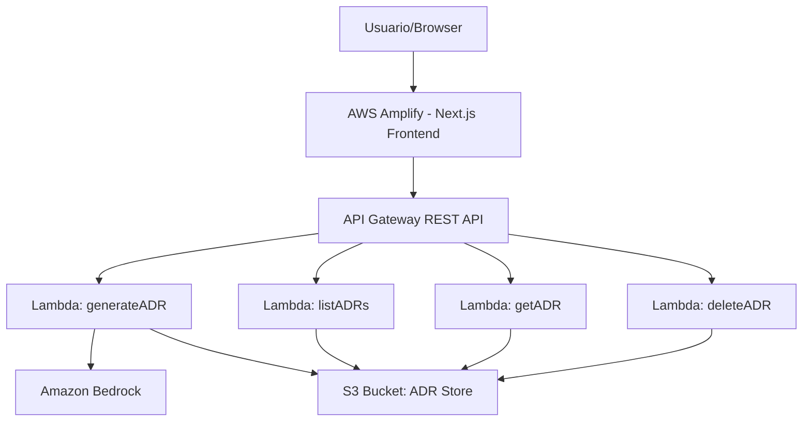
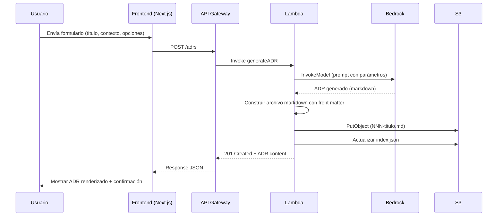

# Design Document: ADR Generator

## Overview

El ADR Generator es una herramienta web personal que permite generar Architecture Decision Records (ADRs) a partir de una descripción breve utilizando IA. La arquitectura sigue un patrón serverless simple: un frontend Next.js desplegado en AWS Amplify que se comunica con un backend Lambda + API Gateway, el cual invoca Amazon Bedrock para la generación de contenido y usa S3 como almacenamiento de los archivos markdown.

El diseño prioriza simplicidad y rapidez de implementación (proyecto de fin de semana), e  liminando complejidades como autenticación, multi-tenancy o colas de procesamiento asíncrono.

## Architecture

### Diagrama de Arquitectura



### Decisiones Arquitectónicas

| Decisión | Razón |
|----------|-------|
| Una sola Lambda con handler por ruta | Reduce cold starts compartiendo runtime, simplifica despliegue |
| API Gateway REST (no HTTP) | Soporte nativo de timeout configuration y throttling |
| S3 como almacenamiento | Sin necesidad de base de datos relacional; los ADRs son documentos markdown inmutables tras creación |
| Metadata en S3 object tags + index file | Evita necesidad de DynamoDB; un archivo `index.json` mantiene el catálogo |
| Next.js App Router con Server Components | Rendering eficiente, menos JavaScript en el cliente |
| Sin autenticación | Herramienta personal, simplifica implementación para un fin de semana |

### Flujo de Generación de ADR



## Components and Interfaces

### Frontend (Next.js en Amplify)

| Componente | Responsabilidad |
|------------|-----------------|
| `app/page.tsx` | Página de inicio con acceso directo al formulario |
| `app/generate/page.tsx` | Vista del formulario de generación |
| `app/adrs/page.tsx` | Vista de listado de ADRs |
| `app/adrs/[id]/page.tsx` | Vista de detalle de un ADR |
| `components/ADRForm.tsx` | Formulario con validación client-side |
| `components/ADRList.tsx` | Componente de lista con estado vacío |
| `components/ADRViewer.tsx` | Renderizador de markdown |
| `components/DeleteModal.tsx` | Modal de confirmación para eliminación |
| `components/LoadingIndicator.tsx` | Indicador con tiempo transcurrido |
| `components/Navbar.tsx` | Navegación persistente |
| `lib/api.ts` | Cliente HTTP para comunicación con el backend |

### Formulario de Entrada — Placeholders y Textos de Ayuda

El formulario incluye textos guía (placeholder y helper text) para orientar al usuario sobre qué información proporcionar en cada campo:

| Campo | Placeholder | Helper Text |
|-------|-------------|-------------|
| **Título** | "Ej: Usar PostgreSQL en vez de MongoDB para pagos" | "Describe brevemente la decisión tomada o por tomar" |
| **Contexto** | "Ej: Necesitamos una base de datos para el módulo de pagos. El equipo tiene experiencia en SQL..." | "Explica: ¿Por qué se necesita tomar esta decisión? ¿Qué problema resuelve? ¿Qué fuerzas o restricciones influyen?" |
| **Stack tecnológico** | "Ej: React, Node.js, AWS Lambda, DynamoDB" | "Opcional: tecnologías relevantes para esta decisión" |
| **Restricciones** | "Ej: Presupuesto limitado, equipo de 3, deadline en 2 semanas" | "Opcional: limitaciones que afectan la decisión" |
| **Nivel de detalle** | _(radio buttons, no placeholder)_ | Breve: ~1 párrafo por sección / Estándar: contexto completo / Detallado: análisis profundo |

### Estilo Visual — Guía de Diseño UI

**Filosofía:** Minimalista, flat design, moderno. Tema oscuro (navy AWS) con acento naranja AWS.

#### Paleta de Colores

| Elemento | Color | Hex | Tailwind |
|----------|-------|-----|----------|
| Navbar fondo | Navy AWS | #232F3E | bg-[#232F3E] |
| Fondo principal | Dark navy | #1A242F | bg-[#1A242F] |
| CTA primario | Naranja AWS | #FF9900 | bg-[#FF9900] |
| CTA primario hover | Naranja claro | #FFB84D | hover:bg-[#FFB84D] |
| CTA secundario | Borde blanco | #FFFFFF | border-white text-white |
| Título | Blanco | #FFFFFF | text-white |
| Subtítulo | Gris claro | #D1D5DB | text-gray-300 |
| Feature card fondo | Navy más claro | #2A3A4A | bg-[#2A3A4A] |
| Feature card borde | Gris tenue | #3B4B5B | border-[#3B4B5B] |
| Texto body cards | Gris suave | #9CA3AF | text-gray-400 |

#### Tipografía

- Font: Inter o font-sans del sistema
- Título hero: text-5xl font-bold (desktop), text-3xl (mobile)
- Subtítulo: text-lg font-normal
- Navbar brand: text-lg font-semibold
- Feature titles: text-base font-semibold
- Feature body: text-sm font-normal

#### Estructura de la Landing (top → bottom)

**1. Navbar**
- Alto: h-14, Fondo: #232F3E, Borde inferior: border-b border-gray-700
- Logo/brand izquierda: "ADR Generator" en blanco semibold
- Links derecha: "Generar" | "Mis ADRs" en text-gray-300 hover:text-white
- Padding horizontal: px-6

**2. Hero Section**
- Padding: py-24 (desktop), py-16 (mobile), centrado: text-center
- Título: "ADR Generator" → text-5xl font-bold text-white
- Subtítulo: "Genera Architecture Decision Records con IA en segundos" → text-lg text-gray-300 mt-4
- Botones stack vertical gap-4 mt-10:
  - Primario: "Generar ADR" → fondo #FF9900, text-white font-semibold, px-8 py-3 rounded-md
  - Secundario: "Ver mis ADRs" → border-white text-white px-8 py-3 rounded-md hover:bg-white/10

**3. Features Section (3 columnas)**
- Fondo: #1A242F, separador: border-t border-gray-700, padding: py-16 px-6
- Grid: grid-cols-1 md:grid-cols-3 gap-8 max-w-4xl mx-auto
- Cada card: fondo #2A3A4A, border border-[#3B4B5B], p-6, rounded-lg
  - 🧠 IA con Amazon Bedrock — Genera ADRs estructurados usando Claude o Nova
  - 📦 Almacenamiento en S3 — Tus decisiones se guardan como Markdown
  - 📄 Formato Markdown estándar — Compatible con cualquier wiki, repo o sistema

**4. Footer**
- Fondo: #232F3E, py-6 px-6, border-t border-gray-700
- Texto: "Construido con Next.js, AWS Lambda y Amazon Bedrock" → text-sm text-gray-400 text-center

#### Interacciones

- Botones: transition-colors duration-200
- Links navbar: transition-colors duration-150
- CTA hover: naranja más claro + cursor-pointer
- Focus visible: focus:ring-2 focus:ring-[#FF9900] focus:ring-offset-2 focus:ring-offset-[#1A242F]

#### Responsive

- Mobile (< 768px): título text-3xl, hero py-16, features 1 columna
- Desktop (≥ 768px): título text-5xl, hero py-24, features 3 columnas

#### Notas

- No sombras ni gradientes (flat)
- No imágenes de fondo
- Emojis como íconos (no icon library)
- El naranja AWS solo en CTA primario para que destaque
- Contraste navy + naranja = branding AWS reconocible

### Mejoras de UX

| Mejora | Descripción |
|--------|-------------|
| **Link al ADR generado** | Después de generar exitosamente un ADR, mostrar un link "Ver ADR" que navega a `/adrs/{id}` para ver el detalle completo |
| **Character counter** | Mostrar contador de caracteres en tiempo real debajo de los campos del formulario (ej: "45/100" para título, "120/2000" para contexto) con color rojo cuando se acerca al límite |
| **Strip front matter en visor** | El ADRViewer debe eliminar el bloque YAML front matter (`---\n...\n---`) antes de renderizar el markdown, para que el usuario solo vea el contenido legible |

### Backend (Lambda + API Gateway)

**Estructura del proyecto Lambda:**

```
backend/
├── src/
│   ├── handlers/
│   │   ├── generateADR.ts      # POST /adrs
│   │   ├── listADRs.ts         # GET /adrs
│   │   ├── getADR.ts           # GET /adrs/{id}
│   │   └── deleteADR.ts        # DELETE /adrs/{id}
│   ├── services/
│   │   ├── bedrockService.ts   # Invocación de Bedrock
│   │   ├── s3Service.ts        # Operaciones S3
│   │   └── adrService.ts       # Lógica de negocio ADR
│   ├── utils/
│   │   ├── promptBuilder.ts    # Construcción del prompt
│   │   ├── markdownBuilder.ts  # Generación del markdown final
│   │   └── slugify.ts          # Conversión a kebab-case
│   └── types/
│       └── index.ts            # Tipos TypeScript
├── package.json
└── tsconfig.json
```

### API Contracts

#### POST /adrs — Generar ADR

**Request:**
```json
{
  "title": "string (5-100 chars, required)",
  "context": "string (20-2000 chars, required)",
  "techStack": "string (max 200 chars, optional)",
  "constraints": "string (max 500 chars, optional)",
  "detailLevel": "brief | standard | detailed (optional, default: standard)"
}
```

**Response 201:**
```json
{
  "id": "string (NNN format)",
  "title": "string",
  "filename": "string (NNN-titulo-kebab.md)",
  "content": "string (full markdown)",
  "createdAt": "string (ISO 8601)",
  "status": "Propuesto"
}
```

**Response 400:**
```json
{
  "error": "VALIDATION_ERROR",
  "message": "string describing validation failures"
}
```

**Response 500:**
```json
{
  "error": "GENERATION_FAILED",
  "message": "La generación del ADR falló. Por favor reintente."
}
```

**Response 504:**
```json
{
  "error": "TIMEOUT",
  "message": "La solicitud excedió el tiempo de espera de 30 segundos."
}
```

#### GET /adrs — Listar ADRs

**Response 200:**
```json
{
  "adrs": [
    {
      "id": "string",
      "title": "string",
      "createdAt": "string (ISO 8601)",
      "status": "Propuesto | Aceptado | Deprecado | Reemplazado",
      "filename": "string"
    }
  ]
}
```

**Response 500:**
```json
{
  "error": "LIST_FAILED",
  "message": "No se pudo cargar la lista de ADRs."
}
```

#### GET /adrs/{id} — Obtener ADR

**Response 200:**
```json
{
  "id": "string",
  "title": "string",
  "filename": "string",
  "content": "string (full markdown)",
  "createdAt": "string (ISO 8601)",
  "status": "string"
}
```

**Response 404:**
```json
{
  "error": "NOT_FOUND",
  "message": "ADR no encontrado."
}
```

#### DELETE /adrs/{id} — Eliminar ADR

**Response 200:**
```json
{
  "message": "ADR eliminado exitosamente."
}
```

**Response 404:**
```json
{
  "error": "NOT_FOUND",
  "message": "ADR no encontrado."
}
```

**Response 500:**
```json
{
  "error": "DELETE_FAILED",
  "message": "La eliminación no se completó."
}
```

### Prompt Engineering (Bedrock)

El prompt se construye dinámicamente basado en los parámetros del usuario:

```
Eres un arquitecto de software senior. Genera un Architecture Decision Record (ADR)
con las siguientes secciones en markdown:

## Título
{title}

## Fecha
{current_date en formato DD/MM/YYYY}

## Estado
Propuesto

## Contexto
Basándote en la siguiente descripción: "{context}"
{Si techStack: "Stack tecnológico: {techStack}"}
{Si constraints: "Restricciones: {constraints}" | "Sin restricciones específicas"}

## Decisión
[Genera la decisión tomada]

## Alternativas Consideradas
[Genera mínimo 2 alternativas con pros y contras]

## Consecuencias
[Genera consecuencias positivas y negativas]

Nivel de detalle: {detailLevel}
- Breve: ~1 párrafo por sección, conciso
- Estándar: contexto completo, 2-3 alternativas bien explicadas
- Detallado: análisis profundo, trade-offs explícitos, referencias
```

## Data Models

### ADR Index Entry (almacenado en `index.json` en S3)

```typescript
interface ADRIndexEntry {
  id: string;           // Número secuencial: "001", "002", etc.
  title: string;        // Título original del ADR
  filename: string;     // Nombre del archivo: "001-titulo-kebab.md"
  createdAt: string;    // ISO 8601 timestamp
  status: ADRStatus;    // Estado del ADR
}

type ADRStatus = "Propuesto" | "Aceptado" | "Deprecado" | "Reemplazado";

interface ADRIndex {
  nextId: number;       // Siguiente número secuencial disponible
  entries: ADRIndexEntry[];
}
```

### ADR Generation Request

```typescript
interface GenerateADRRequest {
  title: string;        // 5-100 caracteres
  context: string;      // 20-2000 caracteres
  techStack?: string;   // máximo 200 caracteres
  constraints?: string; // máximo 500 caracteres
  detailLevel?: "brief" | "standard" | "detailed";
}
```

### ADR Full Response

```typescript
interface ADRResponse {
  id: string;
  title: string;
  filename: string;
  content: string;      // Markdown completo incluyendo front matter
  createdAt: string;
  status: ADRStatus;
}
```

### Front Matter YAML (incluido al inicio del archivo .md)

```yaml
---
title: "Título del ADR"
date: "2026-07-12"
status: "Propuesto"
---
```

### Estructura de Almacenamiento en S3

```
s3://adr-generator-store/
├── index.json              # Catálogo de ADRs
├── adrs/
│   ├── 001-usar-dynamodb.md
│   ├── 002-migrar-a-microservicios.md
│   └── ...
```

### Filename Generation Logic

```typescript
function generateFilename(id: string, title: string): string {
  const slug = title
    .normalize("NFD")
    .replace(/[\u0300-\u036f]/g, "")  // Remover acentos
    .toLowerCase()
    .replace(/[^a-z0-9\s-]/g, "")     // Solo alfanuméricos y espacios
    .trim()
    .replace(/\s+/g, "-")              // Espacios a guiones
    .substring(0, 50)                   // Máximo 50 chars
    .replace(/-$/, "");                 // No terminar en guión

  return `${id}-${slug}.md`;
}
```

## Correctness Properties

*A property is a characteristic or behavior that should hold true across all valid executions of a system — essentially, a formal statement about what the system should do. Properties serve as the bridge between human-readable specifications and machine-verifiable correctness guarantees.*

### Property 1: Filename generation produces valid kebab-case filenames

*For any* valid ADR title (string of 5-100 characters), the `generateFilename` function SHALL produce a filename that: matches the pattern `NNN-[a-z0-9-]+\.md`, has a slug portion of at most 50 characters, does not end the slug with a hyphen, contains no accented characters or special characters, and does not truncate mid-word when possible.

**Validates: Requirements 3.2**

### Property 2: Input validation correctly enforces length constraints

*For any* string input, the validation function SHALL accept titles with length between 5 and 100 characters inclusive and reject all others, AND SHALL accept context descriptions with length between 20 and 2000 characters inclusive and reject all others.

**Validates: Requirements 1.5**

### Property 3: Whitespace-only optional fields are treated as empty

*For any* string composed entirely of whitespace characters (spaces, tabs, newlines, or combinations thereof), the input sanitization function SHALL return `undefined`/empty, ensuring it is not sent to the AI service.

**Validates: Requirements 4.5**

### Property 4: ADR list is sorted by creation date descending

*For any* list of ADR index entries with distinct creation dates, the sort function SHALL return entries ordered such that each entry's `createdAt` timestamp is greater than or equal to the next entry's timestamp.

**Validates: Requirements 2.1**

### Property 5: Date formatting produces valid DD/MM/YYYY strings

*For any* valid ISO 8601 date string, the `formatDate` function SHALL produce a string matching the pattern `DD/MM/YYYY` where DD is 01-31, MM is 01-12, YYYY is a 4-digit year, and parsing the formatted string back produces the same calendar date.

**Validates: Requirements 2.2**

### Property 6: Front matter YAML round-trip preserves ADR metadata

*For any* valid ADR metadata (title as non-empty string, date as valid ISO date, status as one of the valid enum values), generating YAML front matter and then parsing it back SHALL produce equivalent metadata values.

**Validates: Requirements 3.3**

### Property 7: Prompt builder includes user-provided context parameters

*For any* non-empty tech stack string and non-empty constraints string, the `buildPrompt` function SHALL produce a prompt string that contains both the tech stack and constraints values verbatim.

**Validates: Requirements 4.3**

### Property 8: ADR section validator identifies required sections

*For any* valid ADR markdown string containing all required sections (Título, Fecha, Estado, Contexto, Decisión, Alternativas Consideradas, Consecuencias), the validation function SHALL return valid. For any markdown string missing at least one required section, the validation function SHALL return invalid.

**Validates: Requirements 1.1**

### Property 9: Deleting an ADR removes it from the index

*For any* ADR index containing at least one entry and any valid ID within that index, removing the entry with that ID SHALL produce an index where: the entry no longer exists, the length is reduced by exactly one, and all other entries remain unchanged.

**Validates: Requirements 6.4**

## Error Handling

### Estrategia de Errores por Capa

| Capa | Error | Handling |
|------|-------|----------|
| Frontend - Validación | Campos inválidos | Mostrar errores inline bajo cada campo, no enviar request |
| Frontend - Red | Timeout/Network | Mostrar toast de error con opción de reintentar |
| API Gateway | 4xx/5xx | Transformar a mensajes amigables en español |
| Lambda - Bedrock | Invocation failure | Retornar 500 con `GENERATION_FAILED` |
| Lambda - Bedrock | Timeout (>30s) | Retornar 504 con `TIMEOUT` |
| Lambda - S3 (write) | PutObject failure | Retornar 207 con ADR content + error de guardado |
| Lambda - S3 (read) | GetObject failure | Retornar 500 con `LIST_FAILED` o `NOT_FOUND` |
| Lambda - S3 (delete) | DeleteObject failure | Retornar 500 con `DELETE_FAILED` |

### Códigos de Error

```typescript
enum ErrorCode {
  VALIDATION_ERROR = "VALIDATION_ERROR",
  GENERATION_FAILED = "GENERATION_FAILED",
  TIMEOUT = "TIMEOUT",
  SAVE_FAILED = "SAVE_FAILED",
  LIST_FAILED = "LIST_FAILED",
  NOT_FOUND = "NOT_FOUND",
  DELETE_FAILED = "DELETE_FAILED",
  DOWNLOAD_FAILED = "DOWNLOAD_FAILED",
}
```

### Manejo de Timeout

- API Gateway timeout: 30 segundos
- Lambda timeout: 35 segundos (margen para cleanup)
- Frontend: timer visual desde el envío, muestra error si no hay respuesta en 30s
- Bedrock tiene su propio timeout interno; Lambda captura `TimeoutError` y retorna 504

### Respuesta Parcial (Save Failure)

Cuando Bedrock genera el ADR exitosamente pero S3 falla al guardar:
1. Lambda retorna HTTP 207 (Multi-Status) con el contenido del ADR
2. Frontend muestra el ADR generado al usuario
3. Frontend muestra banner de advertencia: "El ADR se generó pero no se pudo guardar"
4. Frontend ofrece botón "Reintentar guardado" que envía PUT /adrs/{id} con el contenido

## Testing Strategy

### Unit Tests (Jest)

Cobertura de funciones puras y lógica de negocio:

- **`slugify.ts`**: Filename generation con distintos inputs (acentos, caracteres especiales, longitud límite)
- **`markdownBuilder.ts`**: Generación de front matter YAML, ensamblado de secciones
- **`promptBuilder.ts`**: Construcción de prompts con/sin parámetros opcionales
- **Validation functions**: Validación de longitud, whitespace sanitization
- **Sort/filter logic**: Ordenamiento de lista de ADRs

### Property-Based Tests (fast-check)

Se utilizará **fast-check** como librería de property-based testing para TypeScript/JavaScript.

Configuración: mínimo 100 iteraciones por propiedad.

Cada test referenciará su propiedad del diseño con el formato:
```
// Feature: adr-generator, Property 1: Filename generation produces valid kebab-case filenames
```

Properties a implementar:
1. Filename generation invariants (Property 1)
2. Input validation boundaries (Property 2)
3. Whitespace sanitization (Property 3)
4. List sorting correctness (Property 4)
5. Date format round-trip (Property 5)
6. Front matter YAML round-trip (Property 6)
7. Prompt builder inclusion (Property 7)
8. Section validator completeness (Property 8)
9. Index deletion invariant (Property 9)

### Integration Tests

- **Bedrock invocation**: Mock de BedrockRuntimeClient, verificar llamada con prompt correcto
- **S3 operations**: Mock de S3Client, verificar PutObject/GetObject/DeleteObject
- **API Gateway handlers**: Tests de cada handler con eventos mock

### E2E Tests (opcional, si queda tiempo)

- Cypress o Playwright para flujo completo: crear ADR → ver en lista → descargar → eliminar
- Prioridad baja para un proyecto de fin de semana

